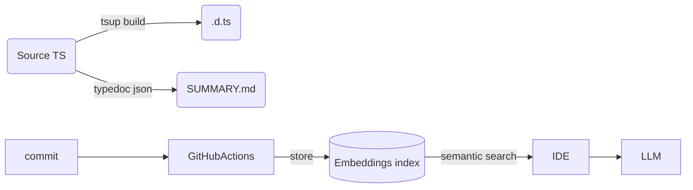

# Copilot / Cursor 忘東忘西？用內部套件穩定大型 TypeScript 專案！

當 Node + TypeScript 專案日益龐大時，Copilot／GPT-4o 可能出現「忘記事情」或重複產生程式碼的情形。為解決這個問題，以下是一份實戰流程表。

## 核心概念
將已穩定的程式碼封裝成獨立內部套件（package），搭配忽略清單、摘要摘要、RAG 策略等手段，讓 LLM 更有效率地理解程式架構。

---

## 1. 封裝成熟程式碼成內部套件

| 步驟 | 具體做法 | 對 LLM 的好處 |
|------|-----------|----------------|
| 找出穩定區塊 | 找 1～2 週內沒改動的 utility、model、schema | 冷凍可縮小活躍程式碼範圍 |
| 搬到 /packages/xyz | 使用 npm workspaces 或 pnpm monorepo | 編輯器少掃目錄，context builder 負擔小 |
| 建立 public API | 僅 re-export 外部要用的東西 | Copilot 掃一個檔案即可理解 API |
| 每次 commit 自動建置 | 產生 .d.ts + bundle | LLM 只吃 .d.ts，不吃完整實作 |
| 鎖定版本 | "private": true 或內網 npm 發布 | 可重用 embeddings 快取 |

> 效果：活躍的 app 檔案數量從 2000 減少到 200，LLM 處理更快更準。

---

## 2. 告訴 LLM 該看哪裡

- `.copilotignore`, `.cursorignore`
  ```
  node_modules/
  packages/*/dist/
  **/*.test.ts
  ```
- `@include-in-context true` 加在特定檔案上
- 自動產生 SUMMARY.md
  ```bash
  typedoc --json → 摘要檔
  ```

---

## 3. 漸進式摘要管線



- Embeddings 僅回傳關聯 k 個符號
- LLM 只看到 type + 摘要，不讀實作

---

## 4. 自動化封裝腳本

```bash
# scripts/promote.sh
pkg=$1
mkdir -p packages/$pkg
git mv src/$pkg packages/$pkg/src
# 建立 package.json
# 寫入 public gateway
```

---

## 5. 開發習慣輔助策略

| 策略 | 用意 |
|-------|------|
| 契約優先測試 | 給 LLM 簡潔、安全範例 |
| DECISIONS.md | 避免回頭用舊方案 |
| 按需重生 context | 減少 noise |
| Embeddings + RAG | 精準查詢 |

---

## 6. 風險與取捨

- 抽太早 → 拖慢速度
- 邊界模糊 → LLM 引用私有 code → 用 ESLint 限制
- 型別重複 → 共用型別抽 @internal/types

---

## 結論

封裝成熟模組、配合忽略與摘要策略，將顯著提升 Copilot / GPT 產出的準確率與效能。

---

## 📦 實作範例 1：count-occurrences 套件

- 主程式：`app/`
- 套件：`packages/count-occurrences`
- 使用 `tsup` + `pnpm workspaces` 管理

## 📦 實作範例 2：billing 套件

- 功能：計算小計、稅額、總額
- API:
  ```ts
  export function calcInvoice(invoice: Invoice): InvoiceResult;
  export function calcLine(line: InvoiceLine): LineResult;
  ```

## 主程式引用：
    ```ts
    import { calcInvoice } from "@internal/billing";
    import { countOccurrences } from "@internal/count-occurrences";
    ```
